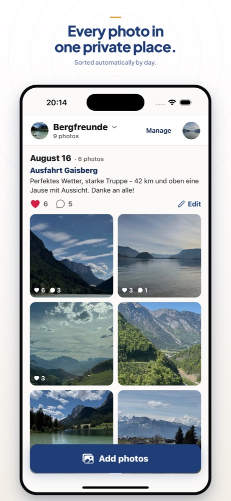
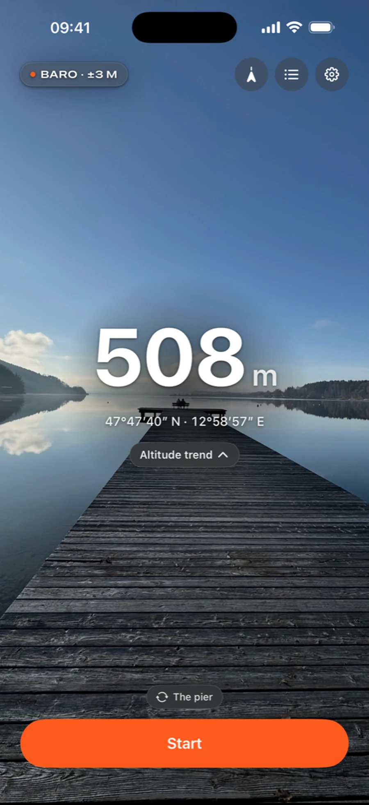
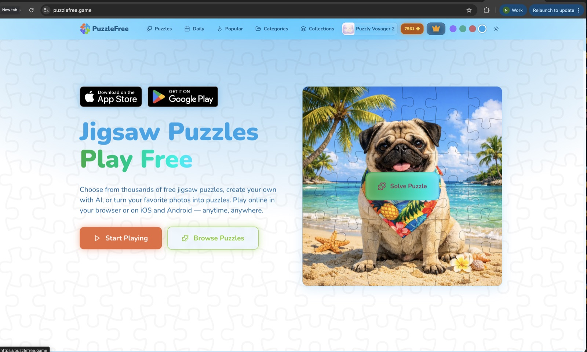
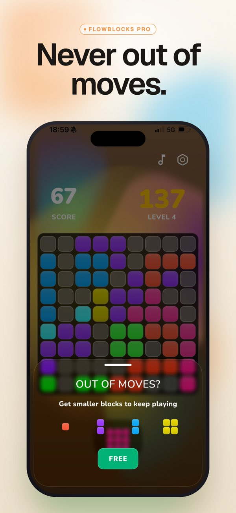
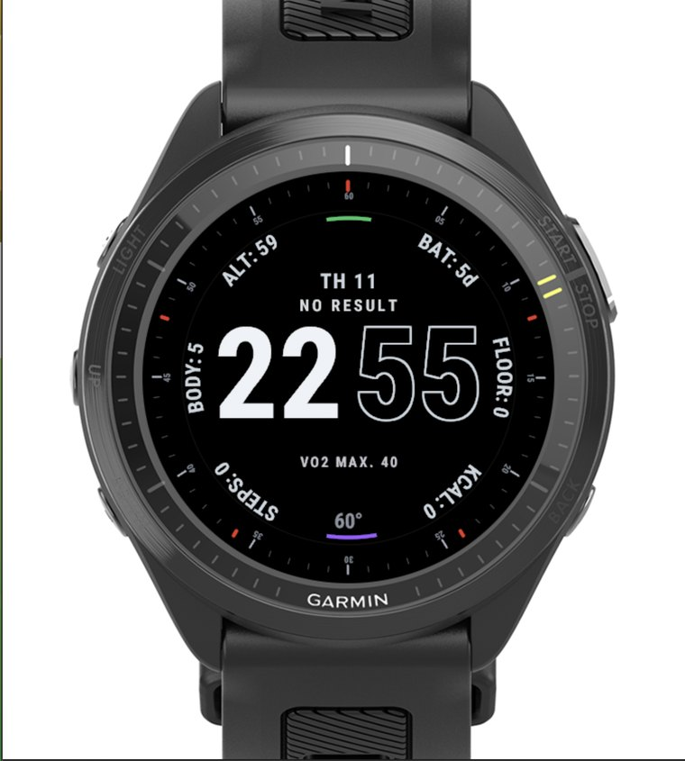
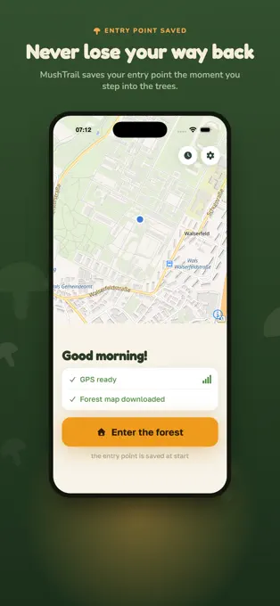

# Nadya Yashchuk

**Product & Project Lead based in Austria**

I turn product ideas into clear, launch-ready mobile apps, web products, and wearable experiences. My work covers product direction, delivery, store presentation, QA, publishing, and post-launch growth.

[Portfolio](https://nadzeyayashchuk.com/) · [LinkedIn](https://www.linkedin.com/in/nadya-yashchuk/) · [Email](mailto:contact@nadzeyayashchuk.com)

## What I work on

- Product ownership from idea to release
- Mobile apps for iOS and Android
- Web products and SaaS
- App Store, Google Play, and Garmin Connect IQ publishing
- Product QA, launch materials, and store presence

## Selected work

### Kreis: Private Photo Groups

Private, invite-only photo groups for families, friends, clubs, and teams, with EU-hosted storage.

[Website](https://meinkreis.app/) · [Google Play](https://play.google.com/store/apps/details?id=com.enidev.kreis)

### VERT — Altimeter & Ski Tracker

Offline altimeter and activity tracker for mountain days, designed around reliable local data and a focused outdoor experience.

[Website](https://vertaltimeter.app/) · [App Store](https://apps.apple.com/us/app/vert-altimeter-ski-tracker/id6791539934)

### PuzzleFree

Cross-platform jigsaw puzzle product with web, iOS, and Android distribution.

[Website](https://puzzlefree.game/) · [App Store](https://apps.apple.com/us/app/jigsaw-puzzles-by-puzzlefree/id6751572041) · [Google Play](https://play.google.com/store/apps/details?id=com.enidev.puzzlefree)

### Block Puzzle Blast: FlowBlocks

An original mobile puzzle concept developed into a polished, store-ready product with a clear visual identity.

[Project page](https://nadzeyayashchuk.com/work/flowblocks-puzzle-game/) · [App Store](https://apps.apple.com/us/app/flowblocks-puzzle-game/id6762732976) · [Google Play](https://play.google.com/store/apps/details?id=com.enidev.flowblocks)

### Garmin Connect IQ Watch Faces

A growing catalog of watch faces prepared and published for Garmin Connect IQ, including listing materials, screenshots, QA, and release packaging.

[View the collection](https://nadzeyayashchuk.com/work/garmin-connect-iq-watch-faces/) · [Garmin developer profile](https://apps.garmin.com/developer/99d754d0-1b13-4e24-b3af-833f50bc1ad1/apps) · [WatchFaceKit](https://watchfacekit.com/)

### MushTrail: Forest Navigator

Offline forest navigation for foraging, with a home compass, saved locations, and trip recap.

[Website](https://mushtrail.com/) · [App Store](https://apps.apple.com/us/app/mushtrail-forest-navigator/id6792751719)

## Published apps

[Apple Developer](https://apps.apple.com/us/iphone/search?term=Nadzeya%20Yashchuk) · [Google Play](https://play.google.com/store/apps/developer?id=Nadzeya+Yashchuk) · [Garmin Connect IQ](https://apps.garmin.com/developer/99d754d0-1b13-4e24-b3af-833f50bc1ad1/apps)

## Contact

I am based in Austria and work with EU and remote teams.

**contact@nadzeyayashchuk.com**
